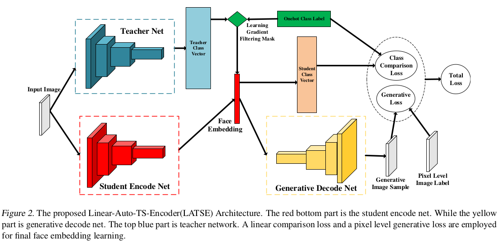

# Huya Dopamine face analysis project

## More Information Supervised Probabilistic Deep Face Embedding Learning(ICML2020)[[paper]](https://arxiv.org/abs/2006.04518)
_Ying Huang*, Shangfeng Qiu*, Wenwei Zhang, Xianghui Luo and Jinzhuo Wang_

We illustrate how the margin based loss methods work for face embedding learning in a perspective of probability and proposed two principles for designing reasonably new margin loss function . 
At the same time,we regard the open-set face recognition as a problem of information transmission and construct an auto-encoder architecture trained with a teacher student learning strategy named LASTE, which increased the generalization ability for the face embedding.



It actually boost the single model performance with open training dataset to more than __99%+__ on MegaFace test easily.
Please see our paper for more details.


## Requirements

- Python 3.6 is used. Basic requirements are listed in the 'requirements.txt'.   

```
   pip install -r requirements.txt
```

## Usage
### Training Data Prepare
All face images are aligned by [RetinaFace](https://github.com/deepinsight/insightface/tree/master/RetinaFace) and cropped to 112x112. 
Then use *data_processing/im2rec.py* to pack face dataset in MXNet binary format to accelerate the training procedure. 

### Train:
* place the training set in `~/huya_face/face_datasets`
* `cd ~/huya_face/analysis/recognition`
* edit `config.py`
* sh recognition_baseline.sh

### Megaface Test:
* prepare test dataset and official test tool in [Megaface](http://megaface.cs.washington.edu/)
* cd `~/huya_face/analysis/recognition/Evaluation/Megaface`
* run run.sh


## License and Citation
The usage of this software is released under the MIT License. There is no limitation for both acadmic and commercial usage.

    @inproceedings{huang2020information,
      title     = {More Information Supervised Probabilistic Deep Face Embedding Learning},
	  author    = {Ying Huang, Shangfeng Qiu, Wenwei Zhang, Xianghui Luo and Jinzhuo Wang},
	  booktitle = {Proc. International Conference on Machine Learning (ICML)},
	  year      = {2020},
	}

## Acknowledgement
- The code structure and open training dataset are borrowed from [InsightFace](https://github.com/deepinsight/insightface.git).


## Contacts
```
Ying Huang: huanying@huya.com  

Shangfeng Qiu: qiushangfeng@huya.com
```

